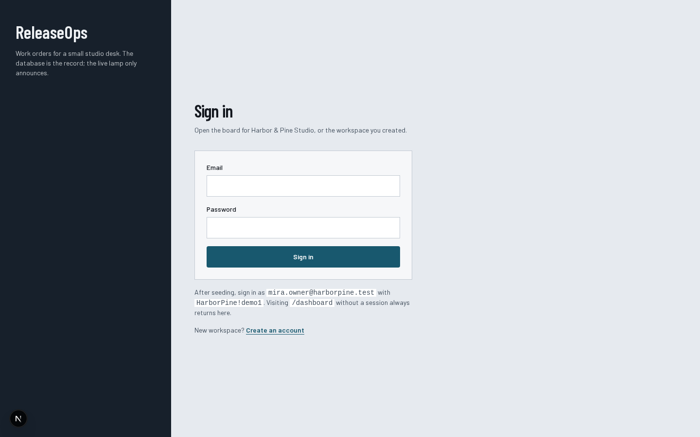
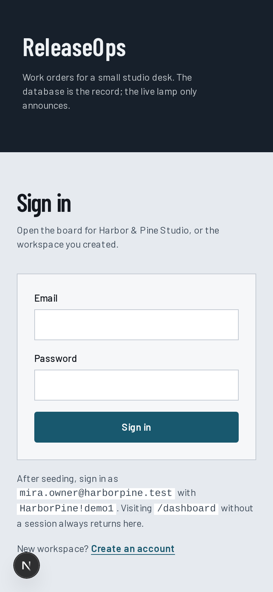
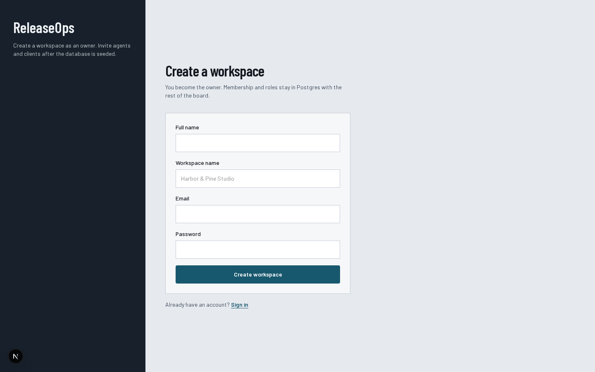
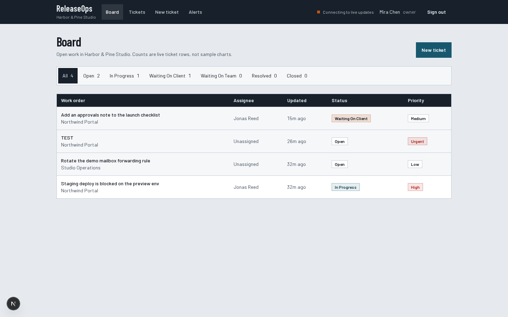
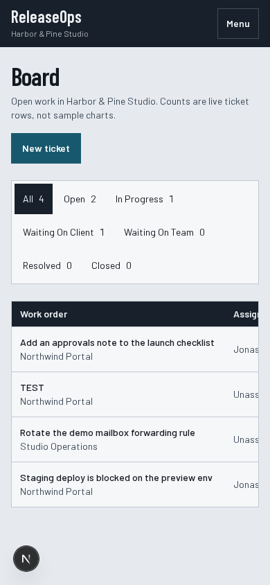
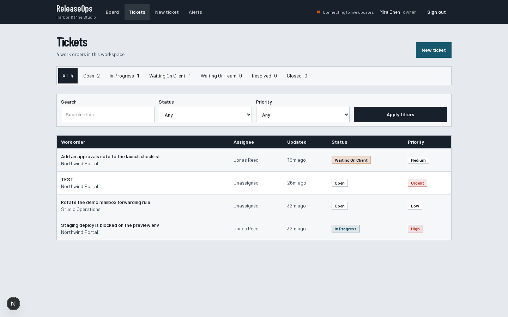
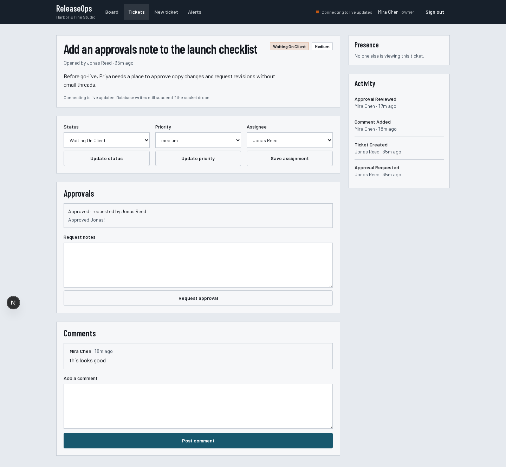
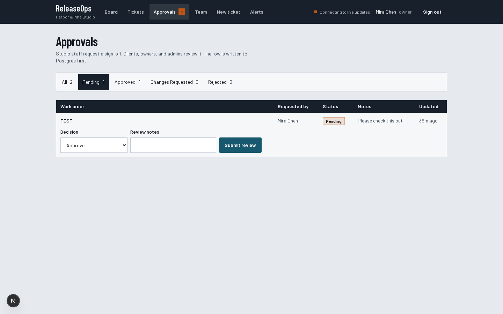
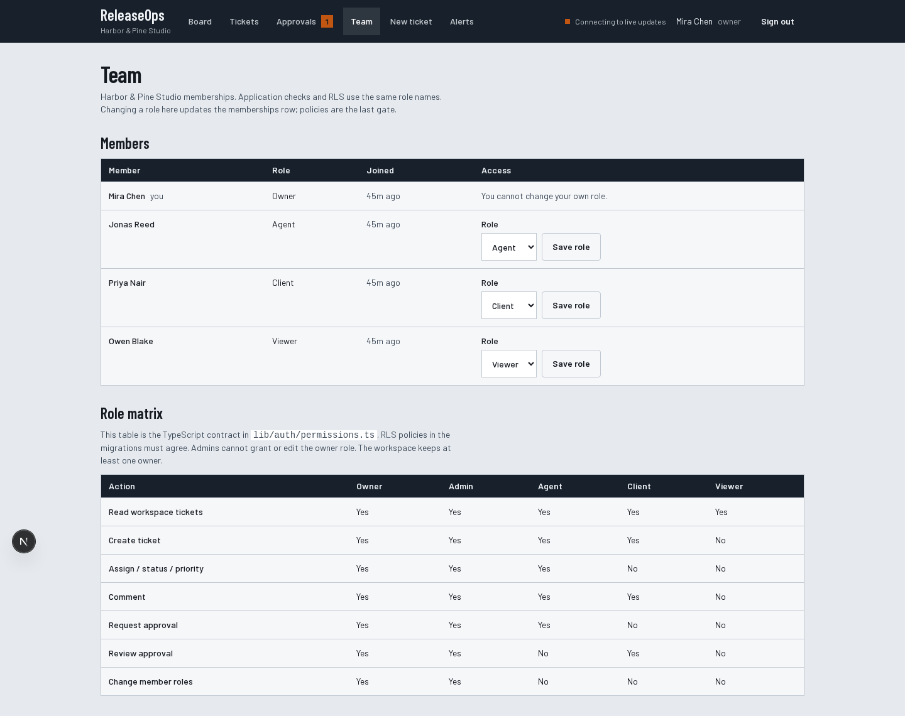

# ReleaseOps

Client portal and work-order management for a small agency or IT service team. Clients file requests. Agents assign, comment, and move status. Both sides see live updates over Supabase Realtime. **Postgres is the source of truth.** The socket only announces.

This is a portfolio project. All people, tickets, and brands in the seed data are synthetic (**Harbor & Pine Studio**). There are no real employers, banks, clients, or credentials.

## Screenshots

Captured from the running overhauled app (Operate / departure-board language). Counts and rows are real ticket data from the seeded project, plus whatever synthetic tickets exist in that database. No invented metrics.

### Sign in





### Create a workspace



### Board

Kanban by ticket status. Owner, admin, and agent drag or pick a status. Clients and viewers open cards only. Moves write to Postgres.





### Tickets



### Ticket detail

Comments, approvals, activity, and presence. The live lamp reports the socket; writes still go to the database if it drops.



### Approvals

Org-wide sign-off queue. Clients, owners, and admins review pending rows. Agents can read the board.



### Team (RBAC)

Membership roster, shareable invite links (email + role, copy `/invite/{token}`), and the published role matrix. Owners and admins invite and change roles; the last owner stays locked. Invite links do not send mail — share the URL. The invitee must sign in with that same email.



Also in `docs/screenshots/`: `signup-mobile.png`, `tickets-mobile.png`, `ticket-detail-mobile.png`, `alerts-desktop.png`, `approvals-mobile.png`, `team-mobile.png`.

## Who it is for

Primary: owners, admins, and agents at a small studio desk, scanning and updating work orders. Secondary: clients filing requests and reviewing approvals. Viewers read only.

Demo org: Harbor & Pine Studio. Projects in the seed (`Northwind Portal`, `Studio Operations`) are fictional.

## Stack

- Next.js 15 App Router, React 19, TypeScript strict (`noUncheckedIndexedAccess`)
- Tailwind CSS v4
- Supabase Auth, PostgreSQL, RLS, Realtime
- Zod for every write
- Jest + React Testing Library
- Playwright for auth pages
- ESLint, Prettier
- GitHub Actions CI
- Vercel-compatible; no VPS

## Demo credentials

Available after you apply `supabase/migrations` and `supabase/seed.sql`. Same password for every seeded user:

| Role | Email | Password |
| --- | --- | --- |
| owner | mira.owner@harborpine.test | HarborPine!demo1 |
| agent | jonas.agent@harborpine.test | HarborPine!demo1 |
| client | priya.client@harborpine.test | HarborPine!demo1 |
| viewer | owen.viewer@harborpine.test | HarborPine!demo1 |

Use two browsers to watch presence and comments land live.

If sign-in returns “Invalid login credentials”, the seed did not create Auth users. Re-run `supabase/seed.sql` in the SQL editor after migrations.

Visiting `/dashboard` without a session always redirects to `/login`.

## Setup

Requires Node 20.9+ (`.nvmrc` is 20).

```bash
nvm use
cp .env.example .env.local
```

You can also use `.env`. Next.js loads both. Create a free Supabase project. Paste:

| Variable | Where | Browser? |
| --- | --- | --- |
| `NEXT_PUBLIC_SUPABASE_URL` | Settings → Data API / Connect | yes |
| `NEXT_PUBLIC_SUPABASE_ANON_KEY` | Settings → API Keys (anon / publishable) | yes |
| `SUPABASE_SERVICE_ROLE_KEY` | Settings → API Keys (service_role) | **never** |
| `NEXT_PUBLIC_SITE_URL` | optional; auth email redirects | yes |
| `PLAYWRIGHT_BASE_URL` | optional; defaults to `http://localhost:3000` | n/a |

Never import the service-role key into a Client Component.

Apply schema and seed:

```bash
npx supabase db push
npx supabase db reset   # local CLI, includes seed.sql
```

On hosted Supabase, run the SQL files in `supabase/migrations/` then `supabase/seed.sql` in the SQL Editor (once, after migrations). Include `20260816020000_create_workspace.sql` so signup can create the first organization, and `20260816030000_invitations.sql` so Team can create invite links. Enable Realtime for `tickets`, `ticket_comments`, `approvals`, `activity_events`, and `notifications` if the publication statements did not apply. Set Auth Site URL and redirect `https://<app>/auth/callback`.

```bash
npm install
npm run dev
```

Open [http://localhost:3000](http://localhost:3000). If port 3000 is busy, Next will pick the next port — check the terminal.

## Scripts

| Command | What it does |
| --- | --- |
| `npm run dev` | App Router dev server |
| `npm run build` | Production build |
| `npm start` | Serve the production build |
| `npm run lint` | Next ESLint |
| `npm run type-check` | `tsc --noEmit` |
| `npm test` | Jest |
| `npm run test:e2e` | Playwright (auth pages) |
| `npm run format` / `format:check` | Prettier |

CI (`.github/workflows/ci.yml`) runs lint, type-check, tests, and build on Node 20. Pushes to `main` then deploy to Vercel after verify succeeds.

## Architecture summary

Feature folders on the App Router. Routes stay thin. `features/` owns flows. `lib/repositories/` owns SQL. Zod + role checks + RLS gate writes. `/dashboard` is the Kanban. `/approvals` is the org-wide sign-off queue. `/team` is the roster, invite links, and role matrix. Realtime is Postgres Changes for durable rows, private Broadcast for typing, Presence for viewers. After a change event the client merges, then `router.refresh()` so Server Components re-read Postgres.

Details:

- [docs/architecture.md](docs/architecture.md)
- [docs/realtime.md](docs/realtime.md)
- [docs/security.md](docs/security.md)
- [docs/design-language.md](docs/design-language.md)
- [DESIGN.md](DESIGN.md)
- ADRs in [docs/adr/](docs/adr/)

## Technical principles

1. The database is the record; the socket only announces.
2. Users only see organizations where they have membership. Every org-owned row has `organization_id`.
3. Application role checks and RLS must agree. RLS is the last gate.
4. Activity and notifications are written by triggers, not by the UI.
5. Every work surface has loading, empty, and error states.
6. Copy names the action and the recovery. No fake performance claims.

## Design language

Railway timetable / departure board. Cool fluorescent paper, steel rail header, Barlow + Barlow Condensed. Status chips with real counts. Hairline tables. No cream-serif SaaS chrome, no tracked kickers, no four-card hero metrics. Status is never color-only.

## Testing

```bash
npm run lint
npm run type-check
npm test
npm run build
npx playwright install chromium   # once
npm run test:e2e
```

Jest covers permissions, Zod, connection state, payload merge, and a couple of UI primitives. Playwright covers login/signup labels. Multi-browser presence still needs a seeded project and two demo users.

## Deployment (Vercel + GitHub Actions)

This is a standard Next.js App Router app. No VPS.

GitHub Actions (`.github/workflows/ci.yml`) verifies every push and pull request. On `main`, a second job deploys with the Vercel CLI after verify passes.

### One-time Vercel link

```bash
npx vercel login
npx vercel link
```

That writes `.vercel/project.json` (gitignored). Copy `orgId` and `projectId`.

### GitHub repo secrets

Settings → Secrets and variables → Actions:

| Secret | Where |
| --- | --- |
| `VERCEL_TOKEN` | [Vercel account tokens](https://vercel.com/account/tokens) |
| `VERCEL_ORG_ID` | `.vercel/project.json` → `orgId` |
| `VERCEL_PROJECT_ID` | `.vercel/project.json` → `projectId` |

Do **not** put Supabase keys in GitHub. Set them on the Vercel project (Production + Preview):

| Variable | Browser? |
| --- | --- |
| `NEXT_PUBLIC_SUPABASE_URL` | yes |
| `NEXT_PUBLIC_SUPABASE_ANON_KEY` | yes |
| `SUPABASE_SERVICE_ROLE_KEY` | **never** (`NEXT_PUBLIC_`) |
| `NEXT_PUBLIC_SITE_URL` | yes (`https://<project>.vercel.app`) |

### Supabase Auth

Add `https://<project>.vercel.app` as Site URL and `https://<project>.vercel.app/auth/callback` as a redirect.

No paid database, queue, LLM, or VPS is required.

## Limitations

- One membership per user is loaded (first created). No org switcher. Accepting an invite into a second org does not switch the session yet.
- Email confirmation depends on your Supabase project settings. Invites are copy-paste links, not extra auth emails.
- Playwright does not log in against a live project in CI.
- Search is title `ilike`, not full-text.
- Storage uploads are not implemented.
- On a narrow phone, the Kanban columns scroll horizontally.

## Future improvements

- Org switcher (needed once a user belongs to more than one workspace)
- File attachments through Supabase Storage
- Playwright flow: create → assign → comment against a seeded preview
- Full-text search if title `ilike` is not enough

Do not start a paid queue, VPS, or LLM for those items.
